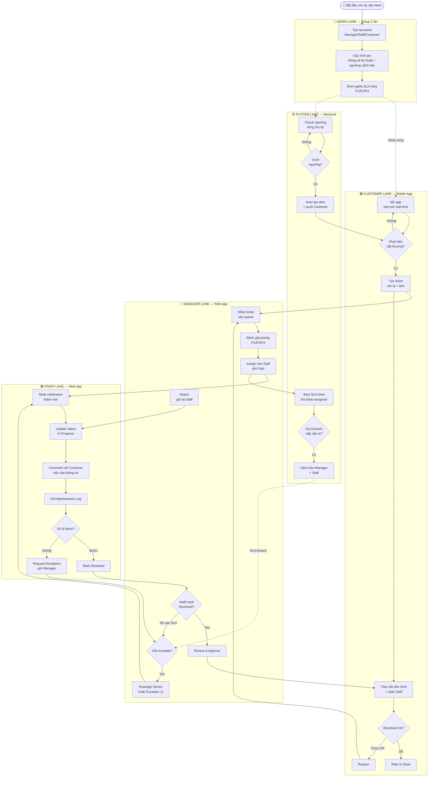
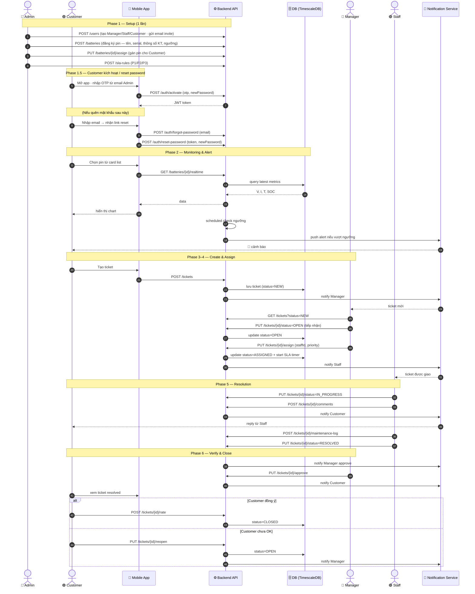
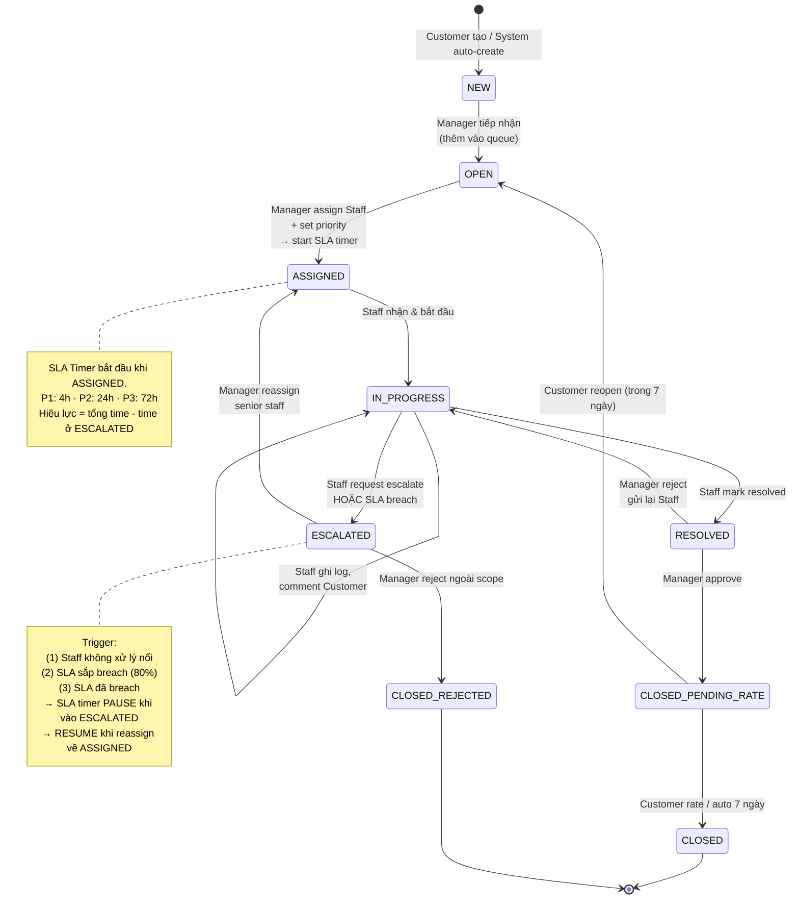
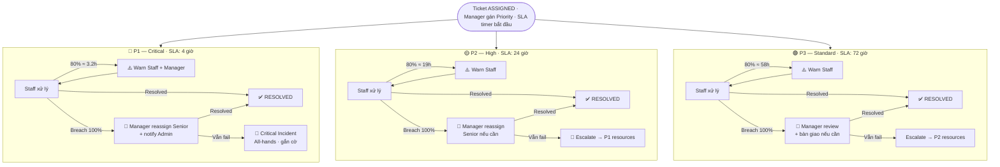
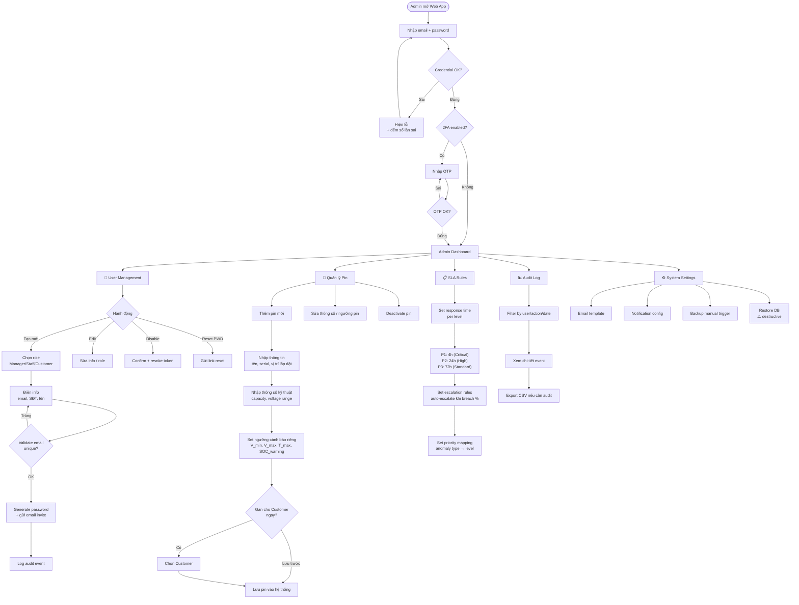
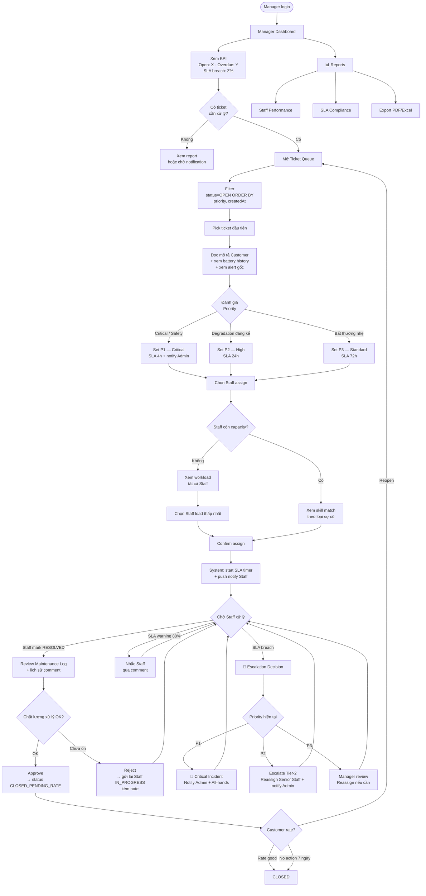
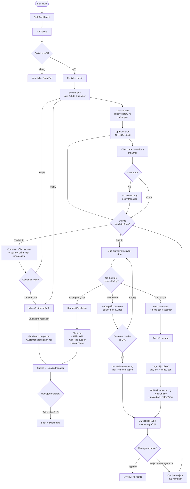
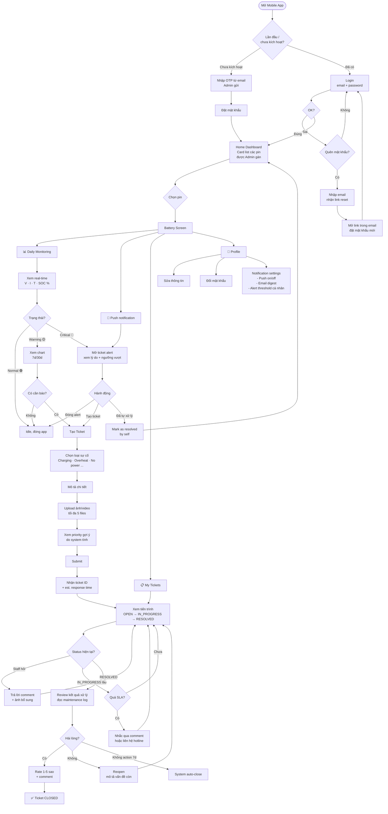

# GSU26SE55 — Core Business Flow

**Quy trình nghiệp vụ cốt lõi** theo 4 role · Scope: SE-only · ITIL Ticket & SLA Management

---

## Vai trò trong hệ thống

| Role | Màu | Mô tả |
|------|-----|-------|
| Admin | 🔴 | Setup/Config — tạo account, cấu hình pin, SLA rules |
| Customer | 🟣 | Tạo ticket, theo dõi tiến trình |
| Manager | 🔵 | Assign, approve, escalate |
| Staff | 🟢 | Xử lý ticket, ghi maintenance log |
| System | 🟡 | Auto alert / SLA timer |

---

## 1. Tổng quan 6 Phase

Quy trình tổng thể chia làm 6 phase. Mỗi phase có 1 role "owner" chính, role khác tham gia phụ.

| # | Phase | Mô tả | Owner |
|---|-------|-------|-------|
| ① | Setup & Configuration | Tạo account, cấu hình loại pin, set ngưỡng cảnh báo, định nghĩa SLA rules P1/P2/P3 | ADMIN |
| ② | Monitoring & Detection | Customer theo dõi pin. System auto-check ngưỡng (mỗi pin có ngưỡng riêng), sinh cảnh báo khi bất thường. IoT data sẽ được tích hợp ở giai đoạn sau | CUSTOMER + SYSTEM |
| ③ | Ticket Creation | Customer tạo ticket thủ công, gắn với pin cụ thể. System có thể auto-tạo ticket từ alert khi tích hợp IoT | CUSTOMER / SYSTEM |
| ④ | Triage & Assignment | Manager review ticket, set priority, assign cho Staff phù hợp. SLA timer bắt đầu | MANAGER |
| ⑤ | Resolution | Staff xử lý: cập nhật status, ghi log, liên hệ customer, mark Resolved hoặc Request Escalation | STAFF |
| ⑥ | Verification & Closure | Manager approve, Customer đánh giá (rate/reopen). Ticket chính thức Closed | MANAGER + CUSTOMER |

---

## 2. Swimlane End-to-End

Mỗi lane là 1 role. Mũi tên cắt ngang lane = handoff giữa các role. Đây là flow chính của hệ thống.

---

## 3. Sequence Diagram — Tương tác role theo thời gian

Góc nhìn khác: ai gọi ai, gọi thứ tự nào. Hữu ích khi thiết kế API contract.

---

## 4. Ticket State Machine

Vòng đời 1 ticket. Mỗi state có role được phép chuyển trạng thái.

---

## 5. SLA Escalation Flow

3 track priority độc lập. Manager gán P1/P2/P3 khi triage — priority **không thay đổi** trong suốt vòng đời ticket. Breach SLA → escalate thêm *nhân lực*, không phải đổi deadline.

---

## 6. Admin — Chi tiết Flow

Admin chỉ hoạt động mạnh ở **Phase 1 (Setup)** và **giám sát định kỳ**. Không tham gia daily operation.

| | |
|---|---|
| **Entry** | Login Web App với tài khoản super-admin |
| **Task chính** | User CRUD · Battery config · SLA rules · Audit log |
| **Tần suất** | Setup 1 lần + cập nhật khi có yêu cầu |
| **Quyền đặc biệt** | Disable account · Reset password · Restore DB |

---

## 7. Manager — Chi tiết Flow

Manager là "điều phối viên" — hoạt động liên tục trong Phase 4 (Triage) và Phase 6 (Verify). Quyết định priority, staff assignment, và escalation.

| | |
|---|---|
| **Entry** | Login Web App khi có ticket mới hoặc kiểm tra định kỳ |
| **Task chính** | Triage ticket · Assign Staff · Approve resolution · Handle escalation |
| **Tần suất** | Daily — check dashboard mỗi 2–4h |
| **Quyền đặc biệt** | Reassign · Approve/Reject · Escalate L2→L3 · Export report |

---

## 8. Staff — Chi tiết Flow

Staff là người trực tiếp xử lý ticket — hoạt động chính ở Phase 5 (Resolution). Cần document kỹ mỗi bước vì sẽ được Manager review.

| | |
|---|---|
| **Entry** | Login Web App · nhận push notification ticket mới |
| **Task chính** | Diagnose · Liên hệ Customer · Apply solution · Ghi log |
| **Tần suất** | Continuous — xử lý multiple tickets song song |
| **Giới hạn** | Không đổi priority · Không approve · Phải escalate khi vượt skill |

---

## 9. Customer — Chi tiết Flow

Customer sử dụng Mobile App — hành vi chia làm 3 loại: **monitoring daily**, **react-to-alert**, và **ticket management**.

| | |
|---|---|
| **Entry** | Mobile App (iOS/Android) · Push notification |
| **Task chính** | Xem pin · Nhận cảnh báo · Tạo/theo dõi ticket · Rate service |
| **Tần suất** | Daily check + khi có alert |
| **Self-service** | Xem history · Export data · Cài đặt notification |

---

*Project GSU26SE55 · Core Business Flow · Generated for SE-only scope*
