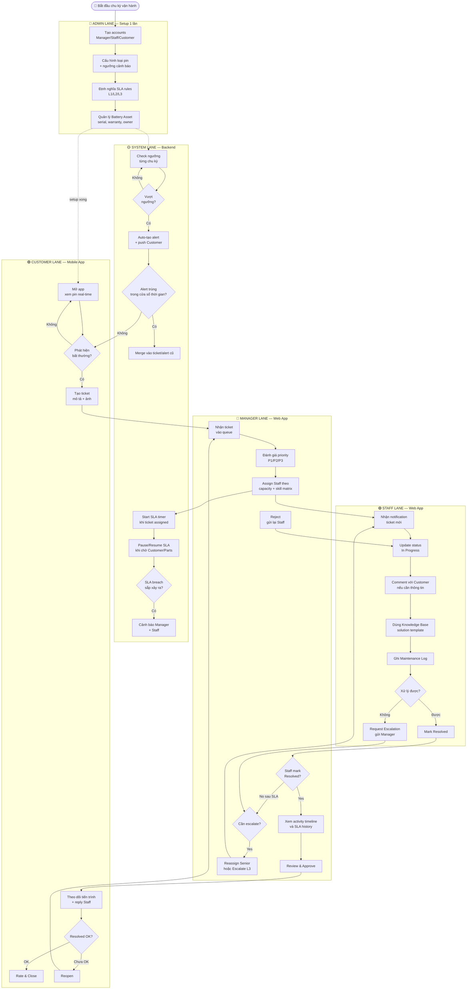
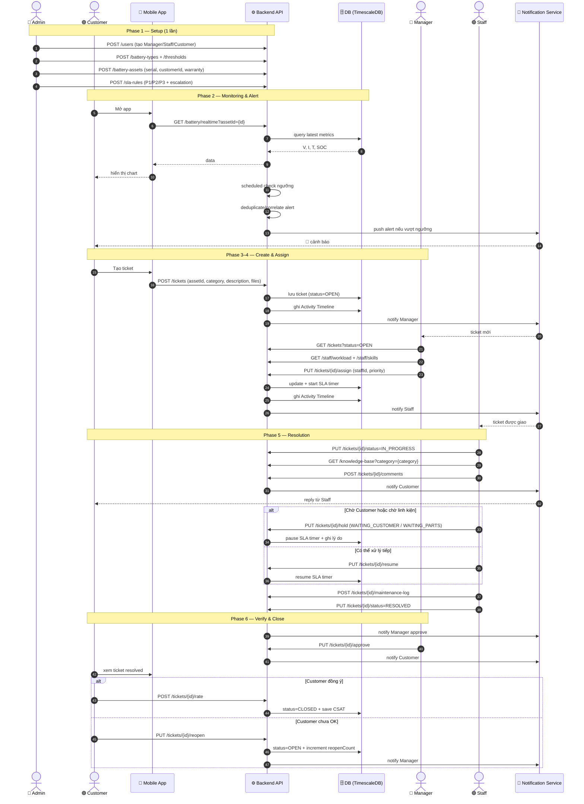
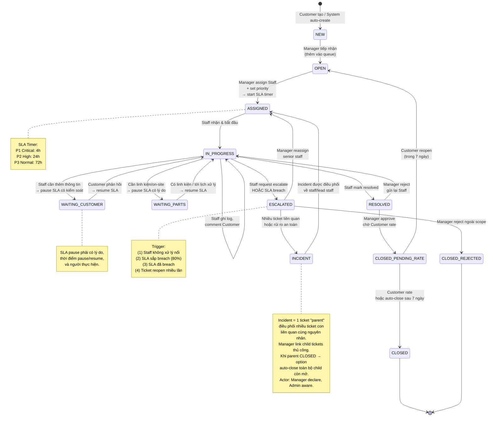
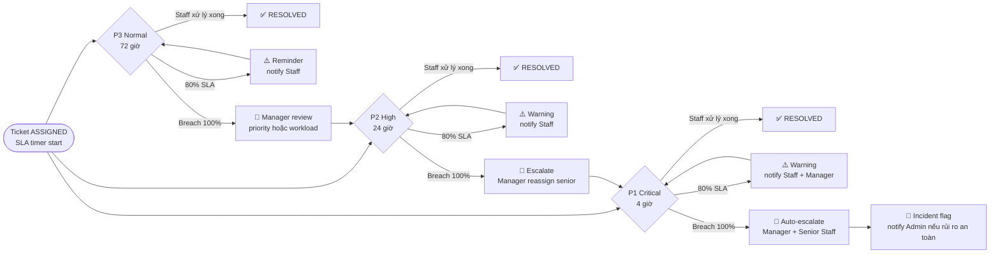
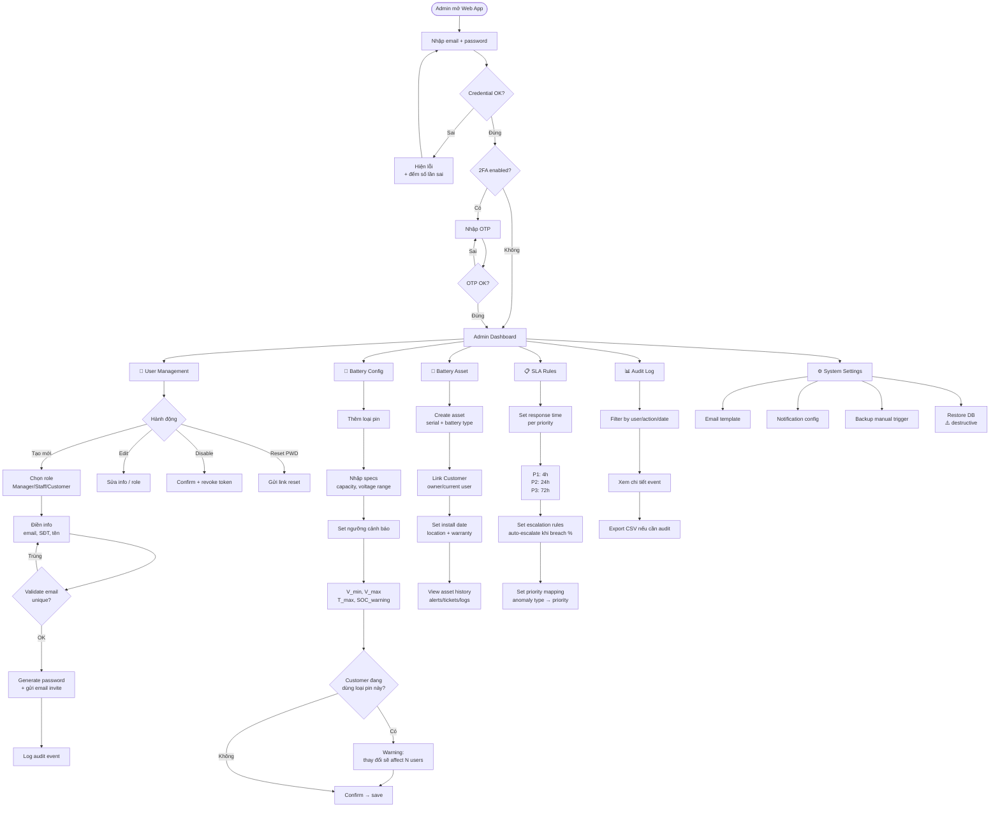
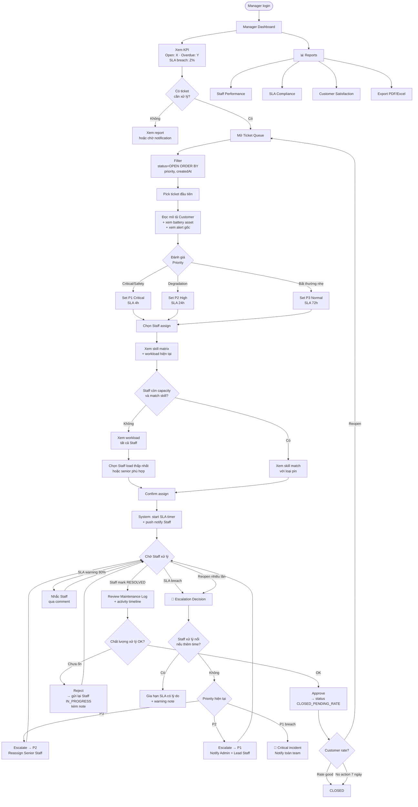
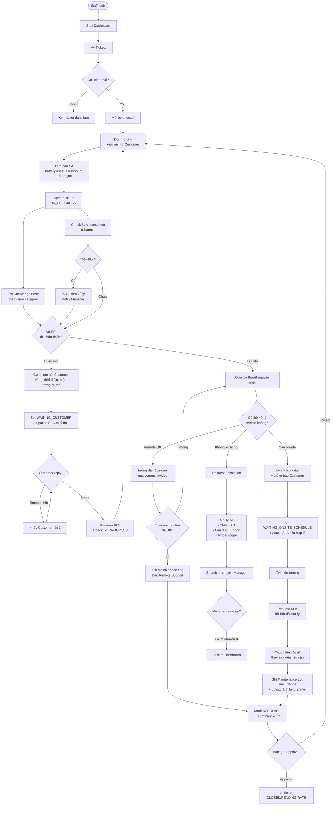
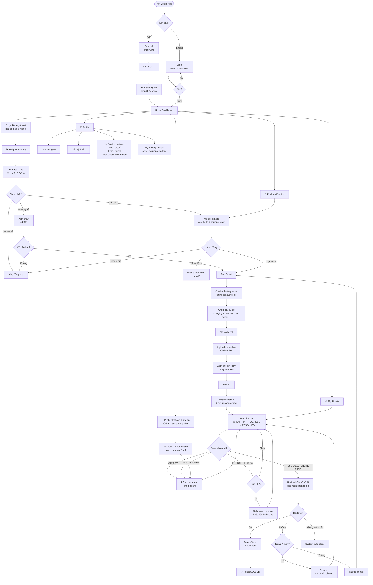

# GSU26SE55 — Core Business Flow

**Quy trình nghiệp vụ cốt lõi** theo 4 role · Scope: SE-only · ITIL Ticket & SLA Management

---

## Vai trò trong hệ thống

| Role | Màu | Mô tả |
|------|-----|-------|
| Admin | 🔴 | Setup/Config — tạo account, cấu hình pin, SLA rules, quản lý Battery Asset |
| Customer | 🟣 | Tạo ticket, theo dõi tiến trình, rate service |
| Manager | 🔵 | Assign, approve, escalate |
| Staff | 🟢 | Xử lý ticket, ghi maintenance log |
| System | 🟡 | Auto alert / SLA timer |

---

## 1. Tổng quan 6 Phase

Quy trình tổng thể chia làm 6 phase. Mỗi phase có 1 role "owner" chính, role khác tham gia phụ.

| # | Phase | Mô tả | Owner |
|---|-------|-------|-------|
| ① | Setup & Configuration | Tạo account, cấu hình loại pin, set ngưỡng cảnh báo, định nghĩa SLA rules P1/P2/P3, quản lý Battery Asset (serial, warranty, owner) | ADMIN |
| ② | Monitoring & Detection | Customer theo dõi pin real-time. System auto-check ngưỡng, sinh cảnh báo khi bất thường | CUSTOMER + SYSTEM |
| ③ | Ticket Creation | Customer tạo ticket thủ công, HOẶC system auto-tạo từ alert critical | CUSTOMER / SYSTEM |
| ④ | Triage & Assignment | Manager review ticket, set priority, assign cho Staff phù hợp. SLA timer bắt đầu | MANAGER |
| ⑤ | Resolution | Staff xử lý: cập nhật status, ghi log, liên hệ customer, mark Resolved hoặc Request Escalation | STAFF |
| ⑥ | Verification & Closure | Manager approve, Customer đánh giá (rate/reopen). Ticket chính thức Closed | MANAGER + CUSTOMER |

---

## 2. Swimlane End-to-End

Mỗi lane là 1 role. Mũi tên cắt ngang lane = handoff giữa các role.

---

## 3. Sequence Diagram — Tương tác role theo thời gian

Góc nhìn khác: ai gọi ai, gọi thứ tự nào. Hữu ích khi thiết kế API contract.

---

## 4. Ticket State Machine

Vòng đời 1 ticket. Mỗi state có role được phép chuyển trạng thái.

---

## 5. SLA Escalation Flow

3 track priority độc lập. Manager gán P1/P2/P3 khi triage — priority **không thay đổi** trong suốt vòng đời ticket. Breach SLA → escalate thêm *nhân lực*, không phải đổi deadline.

> **Lưu ý:** Mũi tên `E2 → P1` và `E3 → P2` thể hiện *luồng xử lý tiếp theo* được áp chuẩn SLA cao hơn — **không có nghĩa là hệ thống tự động đổi priority**. Ticket vẫn ở trạng thái **ESCALATED**; chính **Manager** mới là người quyết định reassign senior Staff, gia hạn SLA có lý do. System chỉ auto-notify và auto-change status → ESCALATED.

---

## 6. Admin — Chi tiết Flow

Admin chỉ hoạt động mạnh ở **Phase 1 (Setup)** và **giám sát định kỳ**. Không tham gia daily operation.

| | |
|---|---|
| **Entry** | Login Web App với tài khoản super-admin |
| **Task chính** | User CRUD · Battery config · Battery asset · SLA rules · Audit log |
| **Tần suất** | Setup 1 lần + cập nhật khi có yêu cầu |
| **Quyền đặc biệt** | Disable account · Reset password · Restore DB · Incident visibility |

---

## 7. Manager — Chi tiết Flow

Manager là "điều phối viên" — hoạt động liên tục trong Phase 4 (Triage) và Phase 6 (Verify). Quyết định priority, staff assignment, và escalation.

| | |
|---|---|
| **Entry** | Login Web App khi có ticket mới hoặc kiểm tra định kỳ |
| **Task chính** | Triage ticket · Assign Staff · Approve resolution · Handle escalation · Review SLA |
| **Tần suất** | Daily — check dashboard mỗi 2–4h |
| **Quyền đặc biệt** | Reassign · Approve/Reject · Escalate P2→P1 · Export report |

---

## 8. Staff — Chi tiết Flow

Staff là người trực tiếp xử lý ticket — hoạt động chính ở Phase 5 (Resolution). Cần document kỹ mỗi bước vì sẽ được Manager review.

| | |
|---|---|
| **Entry** | Login Web App · nhận push notification ticket mới |
| **Task chính** | Diagnose · Liên hệ Customer · Apply solution · Ghi log · Request pause/escalation |
| **Tần suất** | Continuous — xử lý multiple tickets song song |
| **Giới hạn** | Không đổi priority · Không approve · Phải escalate khi vượt skill |

---

## 9. Customer — Chi tiết Flow

Customer sử dụng Mobile App — hành vi chia làm 3 loại: **monitoring daily**, **react-to-alert**, và **ticket management**.

| | |
|---|---|
| **Entry** | Mobile App (iOS/Android) · Push notification |
| **Task chính** | Xem pin · Nhận cảnh báo · Tạo/theo dõi ticket · Rate service |
| **Tần suất** | Daily check + khi có alert |
| **Self-service** | Xem history · Export data · Cài đặt notification · Quản lý thiết bị pin |

---

## 10. Business Rules

| Rule | Mô tả |
|------|-------|
| BR-01 | Ticket phải gắn với Battery Asset (assetId bắt buộc) |
| BR-02 | Alert critical có thể auto-create ticket nếu chưa có ticket đang mở cho cùng asset |
| BR-03 | Dedup alert: cùng asset + anomaly type + time window → append vào ticket hiện tại, không tạo mới |
| BR-04 | SLA pause phải có lý do hợp lệ (WAITING_CUSTOMER / WAITING_PARTS / WAITING_ONSITE_SCHEDULE) và ghi timeline |
| BR-05 | Staff chỉ mark RESOLVED; Manager mới approve → CLOSED_PENDING_RATE |
| BR-06 | Customer chỉ được reopen trong 7 ngày sau resolved/closed pending |
| BR-07 | Reopen ≥ 2 lần → System auto-cảnh báo Manager để review hoặc escalate senior |
| BR-08 | Mọi thay đổi quan trọng (assign, status, pause SLA, approve, reject, reopen) phải lưu actor + timestamp + reason |

### Priority & SLA

| Priority | SLA | Trigger | Breach action |
|----------|-----|---------|---------------|
| P1 Critical | 4h | Rủi ro an toàn, mất điện, nguy cơ hư hại | Manager reassign Senior + notify Admin → Critical Incident nếu vẫn fail |
| P2 High | 24h | Suy giảm hiệu năng rõ rệt, lỗi sạc/xả | Manager reassign Senior nếu cần (priority giữ P2) |
| P3 Normal | 72h | Bất thường nhẹ, câu hỏi vận hành | Manager review + bàn giao nếu cần (ticket không vào ESCALATED) |

> **Priority do Manager gán 1 lần duy nhất** khi triage (OPEN → ASSIGNED). Sau đó **không thay đổi** trong toàn bộ vòng đời ticket. Breach SLA → escalate thêm *nhân lực/cấp bậc*, không phải đổi deadline hay priority. Giữ priority cố định đảm bảo audit trail chính xác và SLA report không bị skew.

### Entity bổ sung nên có trong SRS

| Entity | Mục đích | Trường dữ liệu chính |
|--------|----------|----------------------|
| BatteryAsset | Đại diện một bộ pin cụ thể của Customer | assetId, serialNumber, batteryTypeId, customerId, installDate, warrantyStatus, location |
| Alert | Lưu cảnh báo sinh ra từ dữ liệu pin | alertId, assetId, anomalyType, severity, thresholdValue, actualValue, detectedAt, status |
| TicketActivity | Lưu timeline thao tác trên ticket | activityId, ticketId, actorId, actionType, oldValue, newValue, reason, createdAt |
| SlaTimer | Theo dõi deadline, pause/resume và breach | ticketId, priority, startedAt, dueAt, pausedAt, totalPausedMinutes, breachAt, status |
| KnowledgeBaseArticle | Hỗ trợ Staff xử lý lỗi lặp lại | articleId, category, symptoms, diagnosisSteps, solutionSteps, createdBy, updatedAt |
| CustomerFeedback | Lưu rating và đánh giá sau xử lý | feedbackId, ticketId, rating, comment, createdAt |

---

*Project GSU26SE55 · Core Business Flow · SRS-ready · SE-only scope*
