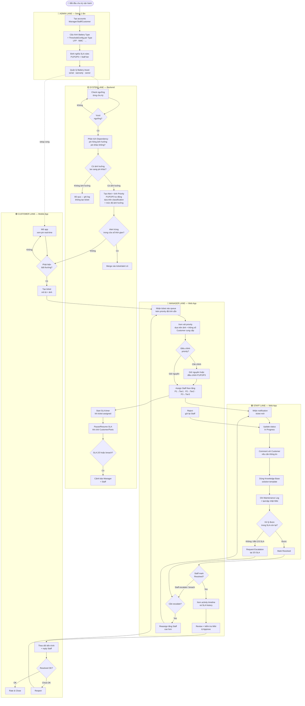
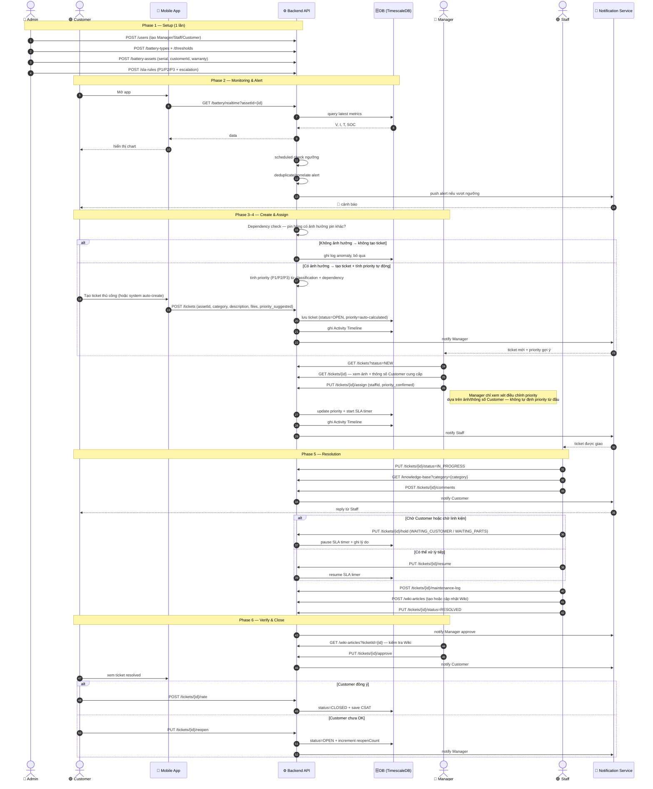
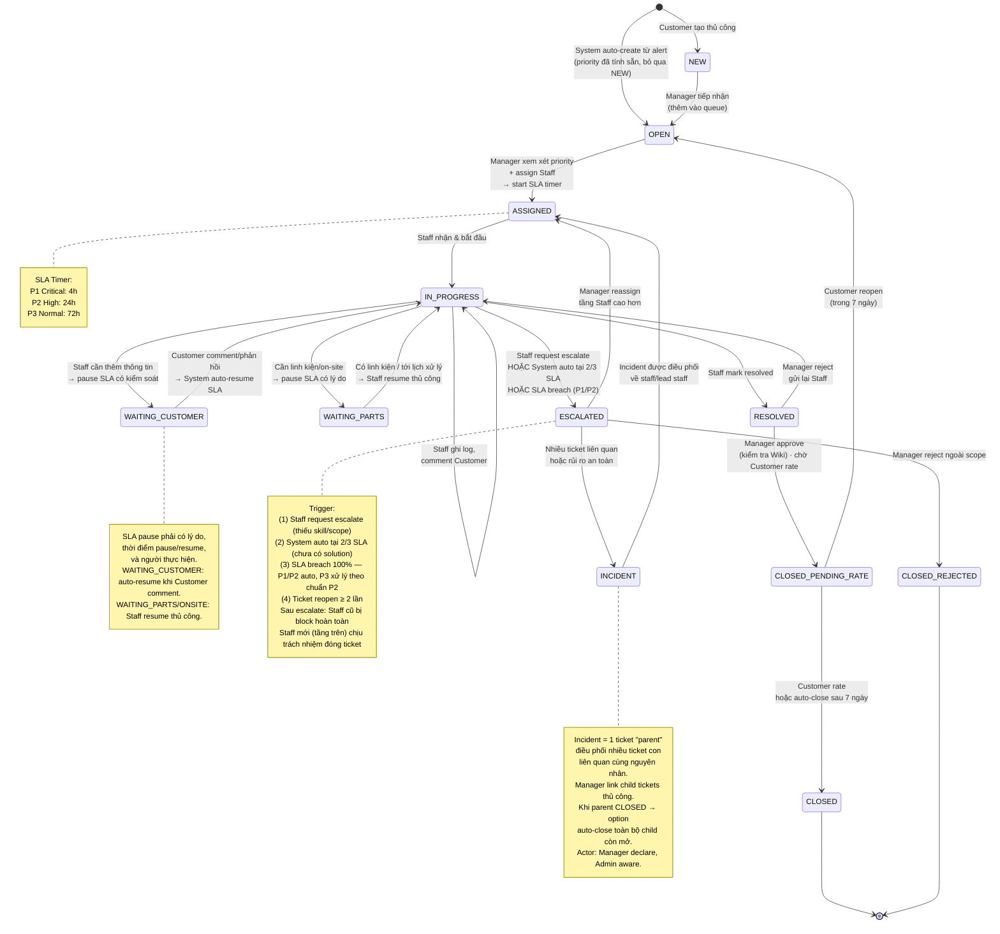
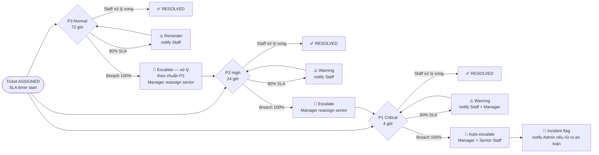
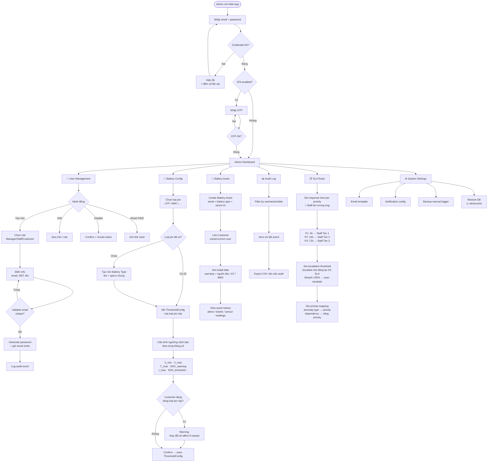
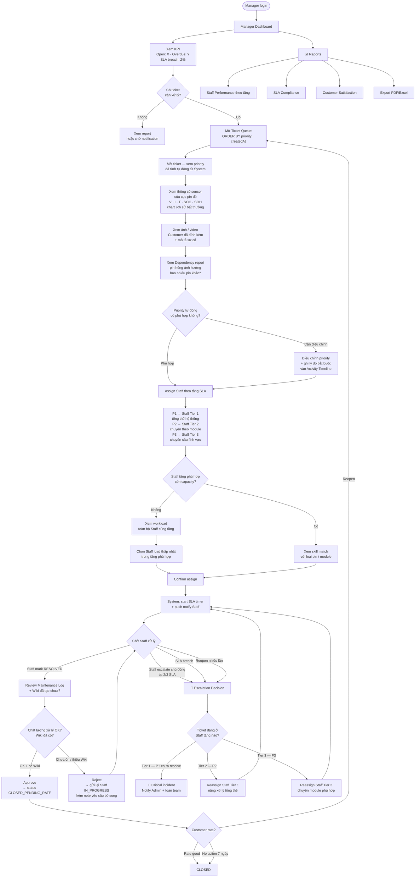
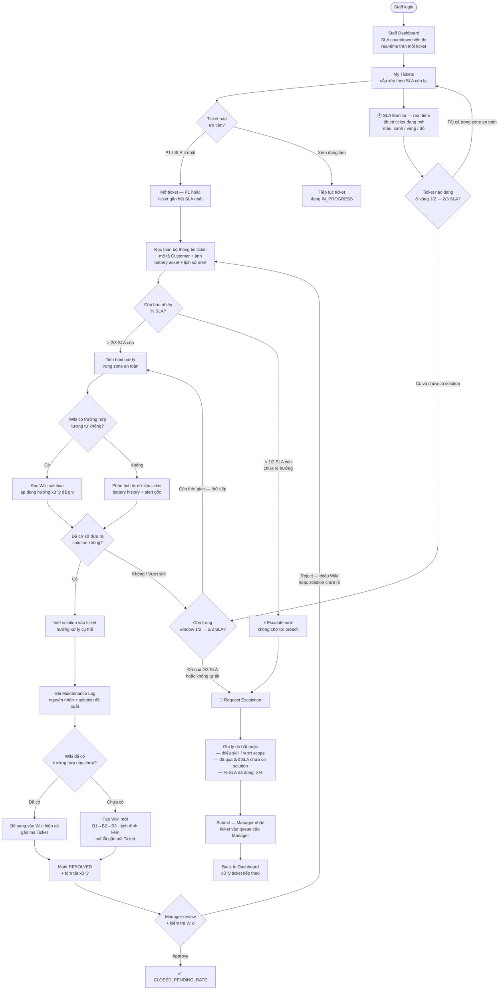
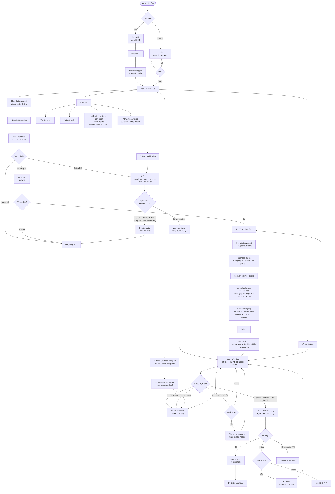

# GSU26SE55 — Core Business Flow

**Quy trình nghiệp vụ cốt lõi** theo 4 role · Scope: SE-only · ITIL Ticket & SLA Management

---

## Vai trò trong hệ thống

| Role | Màu | Mô tả |
|------|-----|-------|
| Admin | 🔴 | Setup/Config — tạo account, cấu hình Battery Type + ThresholdConfig per Type, SLA rules, quản lý Battery Asset |
| Customer | 🟣 | Tạo ticket (+ ảnh/video), theo dõi tiến trình, rate service |
| Manager | 🔵 | Xem xét priority tự động → điều chỉnh nếu cần → assign Staff theo tầng → approve (kiểm tra Wiki) → escalate |
| Staff | 🟢 | Xử lý ticket, ghi maintenance log, tạo/cập nhật Wiki, escalate chủ động tại 2/3 SLA |
| System | 🟡 | Dependency check, auto alert, priority tự động, SLA timer |

---

## 1. Tổng quan 6 Phase

Quy trình tổng thể chia làm 6 phase. Mỗi phase có 1 role "owner" chính, role khác tham gia phụ.

| # | Phase | Mô tả | Owner |
|---|-------|-------|-------|
| ① | Setup & Configuration | Tạo account, tạo Battery Type (LFP/NMC…), cấu hình ThresholdConfig per Type, set ngưỡng cảnh báo, định nghĩa SLA rules P1/P2/P3 + Staff tier, quản lý Battery Asset (serial, warranty, owner) | ADMIN |
| ② | Monitoring & Detection | Customer theo dõi pin real-time. System auto-check ngưỡng, chạy Dependency Check (pin hỏng ảnh hưởng pin khác?), sinh cảnh báo và tính priority tự động khi có ảnh hưởng | CUSTOMER + SYSTEM |
| ③ | Ticket Creation | Customer tạo ticket thủ công (+ ảnh/video), HOẶC system auto-tạo từ alert critical có ảnh hưởng | CUSTOMER / SYSTEM |
| ④ | Triage & Assignment | Manager xem xét priority tự động + ảnh/thông số Customer → điều chỉnh nếu cần → assign Staff đúng tầng. SLA timer bắt đầu | MANAGER |
| ⑤ | Resolution | Staff xử lý theo băng chuyền: cập nhật status, tra Wiki, ghi log, tạo/cập nhật Wiki, liên hệ customer, mark Resolved hoặc escalate chủ động tại 2/3 SLA | STAFF |
| ⑥ | Verification & Closure | Manager review maintenance log + kiểm tra Wiki → approve. Customer đánh giá (rate/reopen). Ticket chính thức Closed | MANAGER + CUSTOMER |

---

## 2. Swimlane End-to-End

Mỗi lane là 1 role. Mũi tên cắt ngang lane = handoff giữa các role.

---

## 3. Sequence Diagram — Tương tác role theo thời gian

Góc nhìn khác: ai gọi ai, gọi thứ tự nào. Hữu ích khi thiết kế API contract.

---

## 4. Ticket State Machine

Vòng đời 1 ticket. Mỗi state có role được phép chuyển trạng thái.

---

## 5. SLA Escalation Flow

3 track priority độc lập. Manager gán P1/P2/P3 khi triage — priority **không thay đổi** trong suốt vòng đời ticket. Staff escalate chủ động tại **2/3 SLA** — không chờ breach. Breach SLA → escalate thêm *nhân lực*, không phải đổi deadline.

> **Lưu ý:** Mũi tên `E2 → P1` và `E3 → P2` thể hiện *luồng xử lý tiếp theo* được áp chuẩn SLA cao hơn — **không có nghĩa là hệ thống tự động đổi priority**. Ticket vẫn ở trạng thái **ESCALATED**; chính **Manager** mới là người quyết định reassign senior Staff theo tầng. System chỉ auto-notify và auto-change status → ESCALATED.

---

## 6. Admin — Chi tiết Flow

Admin chỉ hoạt động mạnh ở **Phase 1 (Setup)** và **giám sát định kỳ**. Không tham gia daily operation. ThresholdConfig được định nghĩa riêng cho từng Battery Type — thay đổi ảnh hưởng toàn bộ asset cùng loại, Admin phải xác nhận.

| | |
|---|---|
| **Entry** | Login Web App với tài khoản super-admin |
| **Task chính** | User CRUD · Battery Type + ThresholdConfig per Type · Battery Asset · SLA rules · Audit log |
| **Tần suất** | Setup 1 lần + cập nhật khi có yêu cầu |
| **Quyền đặc biệt** | Disable account · Reset password · Restore DB · Incident visibility |

---

## 7. Manager — Chi tiết Flow

Manager là "điều phối viên" — hoạt động liên tục trong Phase 4 (Triage) và Phase 6 (Verify). Priority đã được System tính tự động — Manager xem xét ảnh/thông số Customer để xác nhận hoặc điều chỉnh, sau đó assign Staff đúng tầng. Approve phải kiểm tra Wiki.

| | |
|---|---|
| **Entry** | Login Web App khi có ticket mới hoặc kiểm tra định kỳ |
| **Task chính** | Xem xét priority tự động → Điều chỉnh nếu cần → Assign Staff theo tầng → Review Wiki + Approve resolution |
| **Căn cứ xem xét** | Thông số sensor của cục pin đó · Ảnh/video Customer gửi · Dependency report từ System |
| **Giới hạn** | Không tự đặt priority từ đầu — chỉ điều chỉnh từ priority đã tính · Không xử lý ticket trực tiếp |

---

## 8. Staff — Chi tiết Flow

Staff xử lý ticket theo mô hình băng chuyền — nhiều ticket song song. Nhiệm vụ: đọc thông tin → tra Wiki → đưa ra solution → ghi log → **tạo/cập nhật Wiki** → mark Resolved hoặc escalate chủ động. **Bắt buộc escalate tại 2/3 SLA** nếu chưa có solution — không chờ breach.

| | |
|---|---|
| **Entry** | Login Web App · nhận push notification ticket mới |
| **Task chính** | Đọc ticket → Tra Wiki → Đưa ra solution → Ghi log → Tạo/cập nhật Wiki → Resolved hoặc Escalate |
| **Tần suất** | Continuous — xử lý nhiều ticket song song (băng chuyền) |
| **Giới hạn** | Không đổi priority · Không approve resolution · Escalate sớm hơn là muộn hơn · Wiki bắt buộc trước Resolved |

> **Nguyên tắc escalate chủ động:** Mốc cứng tại **2/3 SLA** (P1: ~2h40 · P2: 16h · P3: 48h) mà chưa hoàn thành → bắt buộc escalate ngay. Ghi lý do + % SLA đã dùng.

---

## 9. Customer — Chi tiết Flow

Customer sử dụng Mobile App — hành vi chia làm 3 loại: **monitoring daily**, **react-to-alert**, và **ticket management**.

| | |
|---|---|
| **Entry** | Mobile App (iOS/Android) · Push notification |
| **Task chính** | Xem pin · Nhận cảnh báo · Tạo/theo dõi ticket · Rate service |
| **Tần suất** | Daily check + khi có alert |
| **Self-service** | Xem history · Export data · Cài đặt notification · Quản lý thiết bị pin |

---

## 10. Business Rules

| Rule | Mô tả |
|------|-------|
| BR-01 | Ticket phải gắn với Battery Asset (assetId bắt buộc) |
| BR-02 | Alert critical có thể auto-create ticket nếu chưa có ticket đang mở cho cùng asset và có ảnh hưởng lan sang pin khác |
| BR-03 | Dedup alert: cùng asset + anomaly type + time window → append vào ticket hiện tại, không tạo mới |
| BR-04 | SLA pause phải có lý do hợp lệ (WAITING_CUSTOMER / WAITING_PARTS / WAITING_ONSITE_SCHEDULE) và ghi timeline |
| BR-05 | Staff chỉ mark RESOLVED; Manager mới approve → CLOSED_PENDING_RATE |
| BR-06 | Customer chỉ được reopen trong 7 ngày sau resolved/closed pending |
| BR-07 | Reopen ≥ 2 lần → System auto-cảnh báo Manager để review hoặc escalate senior |
| BR-08 | Mọi thay đổi quan trọng (assign, status, priority, pause SLA, approve, reject, reopen) phải lưu actor + timestamp + reason |
| BR-09 | ThresholdConfig gắn theo Battery Type — thay đổi ngưỡng ảnh hưởng toàn bộ asset cùng loại, Admin phải xác nhận trước khi save |
| BR-10 | Manager assign Staff đúng tầng: P1→Tier 1, P2→Tier 2, P3→Tier 3. Escalate = chuyển lên tầng cao hơn |
| BR-11 | Wiki là quy trình mềm (không enforce cứng). Nếu lỗi đã có Wiki → Staff link ticket vào Wiki sẵn có; nếu chưa có → khuyến khích tạo Wiki mới. Manager có thể reject nếu thiếu hướng dẫn, không bắt buộc mỗi ticket phải tạo Wiki mới |
| BR-12 | Tầng nào nhận ticket thì tầng đó đóng. System auto-trigger ESCALATED tại 2/3 SLA nếu chưa RESOLVED. Sau escalate, Staff cũ bị block hoàn toàn — Staff mới (tầng trên) chịu trách nhiệm đóng ticket. Không có ngoại lệ |

### Priority & SLA

| Priority | SLA | Trigger | Staff tier | Breach action |
|----------|-----|---------|------------|---------------|
| P1 Critical | 4h | Rủi ro an toàn, mất điện, nguy cơ hư hại | Tier 1 (tổng thể) | Manager reassign Senior + notify Admin → Critical Incident nếu vẫn fail |
| P2 High | 24h | Suy giảm hiệu năng rõ rệt, lỗi sạc/xả | Tier 2 (theo module) | Manager reassign Tier 1 (priority giữ P2) |
| P3 Normal | 72h | Bất thường nhẹ, câu hỏi vận hành | Tier 3 (chuyên sâu) | Escalate xử lý theo chuẩn P2 — Manager reassign senior |

> **Priority do System tính tự động** từ classification + dependency. Manager **xem xét và có thể điều chỉnh 1 lần** khi triage (OPEN → ASSIGNED) — phải ghi lý do vào Activity Timeline. Sau đó **không thay đổi** trong toàn bộ vòng đời ticket. Breach SLA → escalate thêm *nhân lực/cấp bậc*, không phải đổi deadline hay priority. Giữ priority cố định đảm bảo audit trail chính xác và SLA report không bị skew.

### Entity bổ sung nên có trong SRS

| Entity | Mục đích | Trường dữ liệu chính |
|--------|----------|----------------------|
| BatteryType | Loại pin (LFP, NMC…) — căn cứ để áp ThresholdConfig | typeId, name, chemistry, nominalVoltage, nominalCapacity |
| ThresholdConfig | Ngưỡng cảnh báo gắn theo Battery Type, do Admin cấu hình | configId, batteryTypeId, voltageMin, voltageMax, tempMax, socWarning, iMax, sohThreshold |
| BatteryAsset | Đại diện một bộ pin cụ thể của Customer | assetId, serialNumber, batteryTypeId, customerId, installDate, warrantyStatus, location, size, dataSource |
| Alert | Lưu cảnh báo sinh ra từ dữ liệu pin | alertId, assetId, anomalyType, severity, thresholdValue, actualValue, detectedAt, status |
| TicketActivity | Lưu timeline thao tác trên ticket | activityId, ticketId, actorId, actionType, oldValue, newValue, reason, createdAt |
| SlaTimer | Theo dõi deadline, pause/resume và breach | ticketId, priority, startedAt, dueAt, pausedAt, totalPausedMinutes, breachAt, status |
| WikiArticle | Ghi lại quy trình xử lý sau mỗi ticket — Staff bắt buộc tạo/cập nhật khi resolve | wikiId, wikiCode, ticketId, category, anomalyType, steps (B1→B2→B3), imageUrls, createdBy, updatedAt, occurrenceCount |
| CustomerFeedback | Lưu rating và đánh giá sau xử lý | feedbackId, ticketId, rating, comment, createdAt |

---

*Project GSU26SE55 · Core Business Flow · SRS-ready · SE-only scope*
