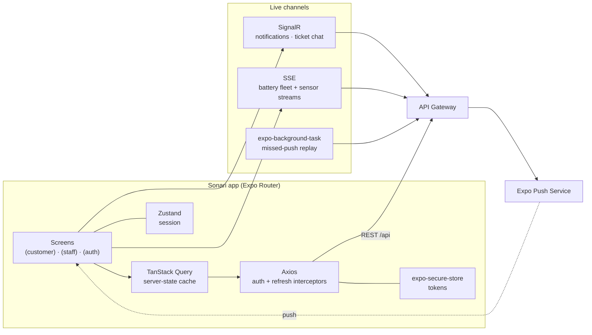

<div align="center">


# Sonari — Mobile App

**Solar battery fleet monitoring and field maintenance, in your pocket.**

[](https://docs.expo.dev)
[](https://reactnative.dev)
[](https://react.dev)
[](https://docs.expo.dev/router/introduction/)
[](https://tanstack.com/query)
[](https://www.typescriptlang.org)
[](https://vitest.dev)

</div>

---

The mobile client of the **Solar Lithium-ion Battery Maintenance Management System** (capstone project GSU26SE55). It serves the two field-facing roles — **Customer** (battery owner) and **Staff** (field technician) — against the same .NET microservice backend as the web portal: live telemetry, alert streams, maintenance tickets with in-app chat, and push notifications that survive a dropped connection.

Admin and Manager work happens in the [web portal](../../frontend); this repository is the mobile app only.

## Table of contents

- [What it does](#what-it-does)
- [Architecture](#architecture)
- [Realtime & notifications](#realtime--notifications)
- [Requirements](#requirements)
- [Getting started](#getting-started)
- [Environment variables](#environment-variables)
- [Scripts](#scripts)
- [Project structure](#project-structure)
- [Key design decisions](#key-design-decisions)
- [Native builds & config plugins](#native-builds--config-plugins)
- [Testing](#testing)
- [Conventions](#conventions)
- [Contributing workflow](#contributing-workflow)
- [Troubleshooting](#troubleshooting)
- [Team](#team)

---

## What it does

| Capability | Customer | Staff |
| --- | :---: | :---: |
| Dashboard with live fleet telemetry | ● | ● |
| Battery list, detail & SOH history charts | ● | ● |
| Sites & installed assets | ● | ● |
| Battery / environmental / device alerts | ● | ● |
| Raise a ticket, track its SLA | ● | — |
| Assigned tickets, maintenance history, field tools | — | ● |
| Customer directory | — | ● |
| In-app ticket chat (realtime) | ● | ● |
| Knowledge base & blog | ● | ● |
| Push notifications & preferences | ● | ● |
| Profile, 2FA, trusted devices, GDPR data export | ● | ● |

Auth covers email/password, Google Sign-In, OTP account activation, 2FA challenge, password reset and account reactivation.

---

## Architecture



---

## Realtime & notifications

Four independent paths keep the app current, each chosen for what it is good at:

| Channel | Used for | Implementation |
| --- | --- | --- |
| **SignalR** | Ticket comments, presence, live notification feed | `features/tickets/hooks/useTicketCommentsRealtime.ts`, `features/notifications/hooks/useNotificationStream.ts` |
| **SSE** | Battery fleet and per-sensor telemetry streams | `features/batteries/hooks/useBatteryFleetStream.ts`, `useBatterySensorStream.ts` |
| **Expo push** | Delivery while the app is backgrounded or closed | `lib/push.ts` — permission + Expo push token, registered against the backend with the device id |
| **Background task** | Replaying notifications missed while SignalR was down | `features/notifications/lib/backgroundSync.ts` — min 15-minute interval, reconciles from `lastSeen` and re-syncs the badge |

The background sync deliberately replays **Push** records rather than in-app rows, so backend push preferences, quiet hours and rate limits are all still honoured on replay.

On Android, ticket chats can surface as **conversation bubbles** — implemented by the local config plugin `plugins/withAndroidChatBubbles.js` (see [Native builds](#native-builds--config-plugins)).

---

## Requirements

- **Node.js 20+** and npm
- **JDK 17** and the Android SDK (Android Studio) for `expo run:android`
- A physical device or emulator; the app talks to the backend API gateway over HTTP
- macOS + Xcode if you intend to run the iOS target

> [!NOTE]
> This is an Expo **managed** project with Continuous Native Generation. `android/` and `ios/` are generated by `expo prebuild` and are **gitignored** — never edit them by hand and never eject.

---

## Getting started

Create a `.env` in the repository root — keys under [Environment variables](#environment-variables) — then:

```bash
npm install
npm start                 # Metro; open in a dev client
npm run android           # prebuild + build + install a dev client on a device/emulator
npm run ios               # same, for iOS (macOS only)
```

Because the app uses native modules (secure store, notifications, Skia, Google Sign-In, camera), it needs a **development build** — Expo Go is not enough. `npm run android` produces one.

Targeting a specific physical device:

```bash
adb devices -l                        # note the `model:` field, not the serial
npx expo run:android --device M2101K9AG
```

Expo matches `--device` against the **model** name reported by `adb devices -l`, not the serial number.

---

## Environment variables

Expo inlines `EXPO_PUBLIC_*` variables at build time — they are visible in the shipped bundle, so never put a secret in one.

| Variable | Required | Description |
| --- | :---: | --- |
| `EXPO_PUBLIC_API_URL` | ✅ | API gateway base URL. On a physical device this must be a LAN address (e.g. `http://192.168.1.10:4001`) — `localhost` resolves to the device itself. |
| `EXPO_PUBLIC_GOOGLE_WEB_CLIENT_ID` | ✅ | Google OAuth web client id — the one Google Sign-In exchanges for an id token the backend can verify. |
| `EXPO_PUBLIC_GOOGLE_IOS_CLIENT_ID` | ✅ | Google OAuth iOS client id; its reversed form is also set as `iosUrlScheme` in `app.json`. |

`.env` is never committed. The EAS `projectId` in `app.json` → `extra.eas` is what `getExpoPushTokenAsync` needs to mint a push token; without it, push registration fails.

---

## Scripts

| Command | Description |
| --- | --- |
| `npm start` | Expo dev server (Metro) |
| `npm run android` | Prebuild if needed, compile and install the Android dev client |
| `npm run ios` | Same for iOS (macOS only) |
| `npm run web` | Expo web target — useful for quick logic checks, not the shipping surface |
| `npm run lint` | `expo lint` (ESLint with `eslint-config-expo`) |
| `npm test` | Vitest, single run |
| `npm run test:watch` | Vitest in watch mode |
| `npm run reset-project` | Expo's scaffold reset script (destructive — do not run casually) |

---

## Project structure

```
app/                             # File-based routing (Expo Router, typed routes)
├── _layout.tsx                  # QueryClient, AuthProvider, theme, push + background task init
├── index.tsx                    # Redirect by role
├── (auth)/                      # login · login-2fa · register · verify-otp
│                                # forgot-password · reactivate · use-web-app
├── (customer)/
│   ├── (tabs)/                  # dashboard · batteries · alerts · tickets · profile
│   └── batteries · sites · incidents · tickets · chats · blog · settings
├── (staff)/
│   ├── (tabs)/                  # dashboard · customers · notifications · profile
│   └── tickets · batteries · sites · incidents · chats · kb · tools
│       · maintenance-history · notification-preferences
└── notification/                # deep-link targets for a tapped push (open, chat)

src/
├── features/                    # account · ambient · auth · batteries · battery-types
│   │                            # blog · file-storage · incidents · iot-devices · kb
│   │                            # notifications · permissions · profile · sites · staff · tickets
│   └── {feature}/               # components · hooks · services · schemas · types · enums · lib
├── shared/                      # components · hooks · schemas · enums · utils
├── lib/                         # axios · secureStore · endpoints · queryKeys · authz
│                                # push · notifications · chatOutbox · deviceId · theme · date
├── stores/sessionStore.ts       # Zustand auth session
├── context/                     # AuthProvider (hydration, 3-case boot)
├── hooks/                       # useCountdown · useRefetchOnFocus · useKeyboardVisible · …
└── config/                      # googleAuth
plugins/                         # local Expo config plugins (native customisation)
docs/                            # backend API contracts this client codes against
```

`app/` holds **routes only** — screens compose feature code from `src/`. Anything shared by both role groups lives in `src/shared/` or `src/lib/`.

---

## Key design decisions

**Tokens in `expo-secure-store`, never `AsyncStorage`.** `lib/secureStore.ts` is the only accessor; `AsyncStorage` is reserved for non-sensitive cache such as the chat outbox.

**One Axios instance, mirroring the web client.** `lib/axios.ts` attaches the bearer token, detects expiry from the JWT `exp`, refreshes once with a queue for concurrent 401s, and maps backend errors into `HttpError` / `EntityError` — the same contract the web app uses, so a fix in one is portable to the other.

**No React Hook Form.** It is designed for web DOM; forms here validate with Zod through an explicit `schema.safeParse()` on submit. Schemas themselves stay identical in shape to the web ones.

**No API calls in components.** Every request goes `services/` → TanStack Query hook → screen. Zustand carries only the auth session, never server data.

**Offline-tolerant chat.** `lib/chatOutbox.ts` is a per-ticket FIFO outbox held outside React and persisted to `AsyncStorage`, so a message composed with no signal survives an app restart and is sent when the connection returns — the thread renders it as "sending" / "failed" meanwhile. It mirrors the web outbox, adapted to an async storage backend.

**`as const` enums, not TypeScript `enum`** — mirroring the web codebase, so DTO types line up across the two clients.

**React Compiler is on** (`app.json` → `experiments.reactCompiler`), so components are written without manual memoisation noise.

---

## Native builds & config plugins

Native customisation happens through config plugins, never by editing generated native code:

| Plugin | Purpose |
| --- | --- |
| `plugins/withAndroidChatBubbles.js` | Registers the chat-bubble activity in `AndroidManifest.xml` and cleans up the obsolete bubble messaging service, leaving `expo-notifications`' own Firebase service untouched |
| `plugins/withWindowsCmakeVersion.js` | Pins the CMake version so Android builds work on Windows hosts |

Managed plugins in use: `expo-router`, `expo-splash-screen`, `expo-font`, `expo-secure-store`, `expo-audio`, `expo-background-task`, `expo-notifications`, `@react-native-google-signin/google-signin`, `@react-native-community/datetimepicker`.

Android permissions requested: `RECORD_AUDIO`, `MODIFY_AUDIO_SETTINGS`, `POST_NOTIFICATIONS`.

---

## Testing

```bash
npm test
npm run test:watch
```

Vitest runs in a **node** environment, not jsdom: the suite targets pure logic — date formatting, authorization checks, token decoding, environmental threshold classification — code that behaves identically on iOS, Android and in Node. Rendering a React Native tree would require Metro and its own preset, cost far more, and prove nothing extra for these functions. Tests live next to the code they cover (`src/**/*.test.ts`).

---

## Conventions

| Kind | Pattern | Example |
| --- | --- | --- |
| Route / screen | `{name}.tsx` (lowercase) | `dashboard.tsx` |
| Dynamic route | `[id].tsx` | `tickets/[id].tsx` |
| Component | `{Name}.tsx` (PascalCase) | `BatteryCard.tsx` |
| Hook | `use{Name}.ts` | `useBatteries.ts` |
| Service | `{name}.service.ts` | `ticket.service.ts` |
| Types | `{name}.types.ts` | `notification.types.ts` |

Non-negotiables:

- Never eject from the Expo managed workflow; native changes go through `plugins/`.
- Tokens in `expo-secure-store` only.
- No API calls inside components — `services/` → TanStack Query hook.
- One Axios instance (`src/lib/axios.ts`); all paths come from `src/lib/endpoints.ts`.
- Do not add a dependency the current stack already covers.
- Never commit `.env` or `.claude/CLAUDE.local.md`.

---

## Contributing workflow

One issue → one branch → one PR.

```bash
git switch -c feat/GH-123-short-slug
# implement, then:
npm run lint && npm test
git commit -m "feat(#123): short description"
```

- Branches: `feat/GH-<n>-slug`, `fix/GH-<n>-slug`, `chore/…`, `docs/…`, `refactor/…`, `test/…`
- Commits: `type(#<issue>): description`
- PR body must contain `Closes #<issue>`
- Never push to `main` or `dev` directly; every PR needs ≥ 1 approving review and authors do not merge their own

---

## Troubleshooting

<details>
<summary><b><code>BUILD SUCCESSFUL</code> but the app crashes with <code>NativeModule: X is null</code></b></summary>

Gradle decides whether to re-run autolinking by comparing a hash stored at `android/build/generated/autolinking/package.json.sha`. If `node_modules` changed while `package.json` did not — a fresh clone, or an `npm install` after the dev client was already built — the hash still matches, the task is skipped, and the APK ships without the module. The tell is `:app:packageDebug UP-TO-DATE` plus an `autolinking.json` with an old timestamp.

`--reset-cache` does not help: it clears the JS bundle cache only.

**Fix:** delete `android/build/generated/autolinking` and `android/app/build/generated/autolinking`, then rebuild. Verify with the artifacts, not the `BUILD SUCCESSFUL` line — `autolinking.json` must carry a fresh timestamp and name the package, and `android/app/build/generated/autolinking/.../PackageList.java` must contain the matching `new XxxPackage()` line.

</details>

<details>
<summary><b><code>Could not find device with name …</code>, or Expo opens an emulator instead of my phone</b></summary>

Two separate causes:

1. `--device` takes the **model** from `adb devices -l` (e.g. `M2101K9AG`), not the serial (`dd2b2ae7`).
2. Two `adb` binaries on `PATH` (a standalone `C:\adb\adb.exe` and the Android SDK's `platform-tools`) kill each other's server with `adb server is out of date`. If Expo asks for the device list at that moment it gets an empty list and falls back to an emulator. Put `platform-tools` first on `PATH`, or remove the standalone copy.

</details>

<details>
<summary><b>The app cannot reach the API from a physical device</b></summary>

`EXPO_PUBLIC_API_URL` must be a LAN address reachable from the phone (`http://192.168.x.x:4001`), not `localhost` — on the device that resolves to the device. Both must be on the same network, and the gateway must listen on `0.0.0.0`. Cleartext HTTP is already allowed on both platforms (`usesCleartextTraffic`, `NSAllowsArbitraryLoads`) for development.

</details>

<details>
<summary><b>Push notifications never arrive</b></summary>

Check, in order: notification permission granted; `extra.eas.projectId` present in `app.json` (required by `getExpoPushTokenAsync`); the token was registered with the backend for this device id; and that you are on a **development build**, not Expo Go. Push tokens cannot be minted on a simulator.

</details>

---

## Team

Capstone project **GSU26SE55** — supervisor: Trương Long. Mobile maintainers:

| Name | Student ID | GitHub |
| --- | --- | --- |
| Trần Minh Trí (Team lead) | SE183109 | [@Shu1237](https://github.com/Shu1237) |
| Nguyễn Nhật Minh | SE170310 | [@CodeForFee](https://github.com/CodeForFee) |
